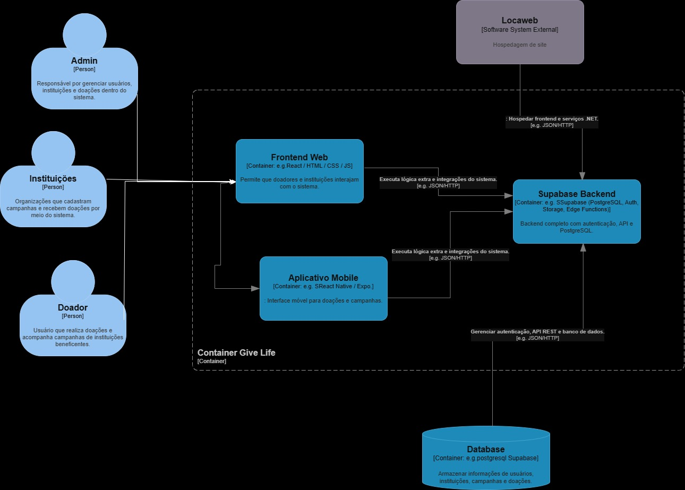
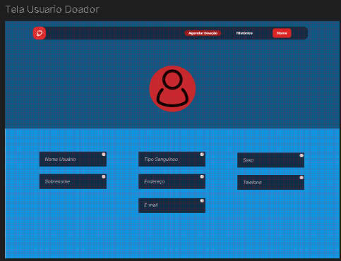
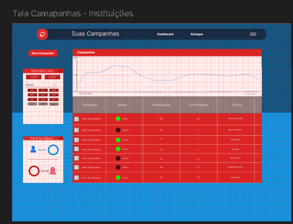
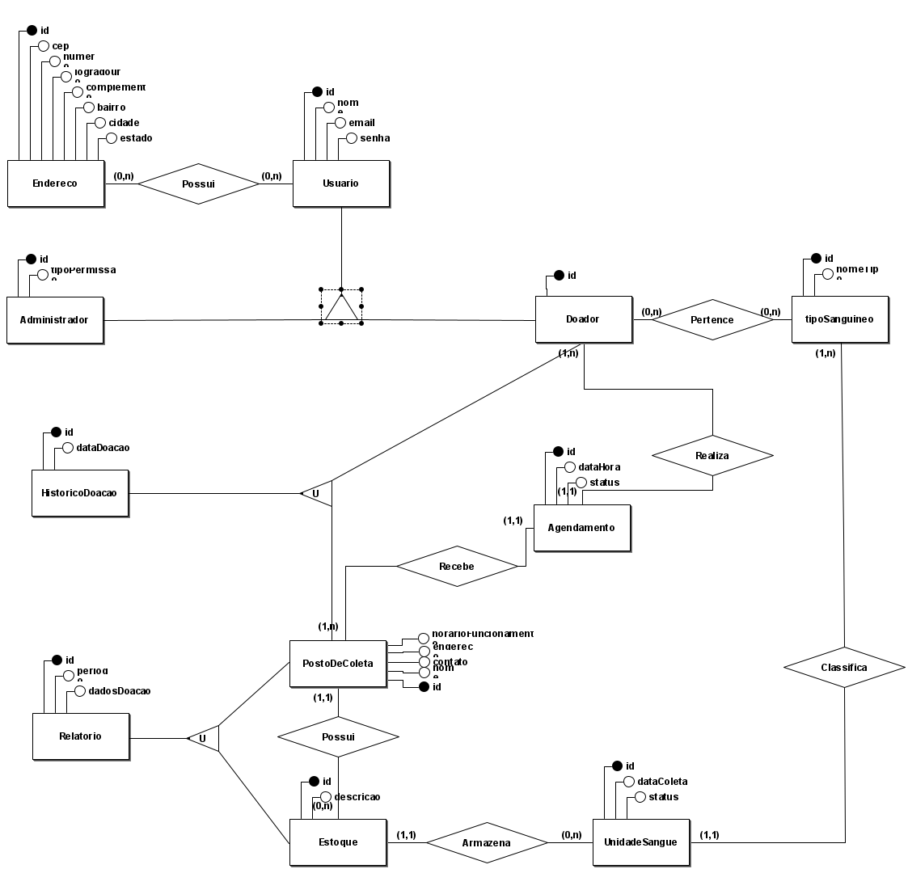

# 4. Projeto da Solução

<span style="color:red">Pré-requisitos: <a href="03-Modelagem do Processo de Negocio.md"> Modelagem do Processo de Negocio</a></span>

---
**ARQUITETURA DO SOFTWARE**
## 4.1. Arquitetura da Solução

Nesta seção, descreva como os componentes do sistema se organizam e interagem.  
Inclua um **diagrama de arquitetura** mostrando módulos, camadas e tecnologias utilizadas.

**Orientações:**
- Indique quais módulos compõem a solução (ex.: frontend, backend, banco de dados, APIs externas).
- Especifique as tecnologias e frameworks adotados (ex.: React, Node.js, MySQL).
- Explique como ocorre a comunicação entre os módulos.

**Exemplo de diagrama:**
 
 

O diagrama apresenta a arquitetura do sistema Give Life, desenvolvido para gerenciar doações e campanhas beneficentes. Ele ilustra os principais tipos de usuários, os módulos internos do sistema e a relação com serviços externos de hospedagem.

1. Usuários

Admin: responsável por gerenciar usuários, instituições e doações.

Instituições: organizações que criam campanhas e recebem doações.

Doadores: usuários que realizam doações e acompanham campanhas.

Esses perfis acessam o sistema por meio do site (frontend web) ou do aplicativo móvel.

2. Componentes Internos do Sistema

Frontend Web (React / HTML / CSS / JS):
Interface acessada via navegador, que permite interação de doadores e instituições. Conecta-se ao backend para envio e recebimento de dados via requisições HTTP/JSON.

Aplicativo Mobile (React Native / Expo):
Interface voltada a dispositivos móveis, com funcionalidades de acesso a campanhas e realização de doações. Comunica-se com o backend de forma semelhante ao frontend web.

Supabase Backend (PostgreSQL, Auth, Storage, Edge Functions):
Responsável pela lógica central do sistema, autenticação de usuários, processamento de dados e disponibilização de APIs REST. Atua como intermediário entre o frontend, o aplicativo móvel e o banco de dados.

Database (PostgreSQL / Supabase):
Armazena informações de usuários, instituições, campanhas e doações.
É considerado um componente interno do sistema, embora esteja hospedado em infraestrutura externa (nuvem) por meio da plataforma Supabase.

3. Serviço Externo

Locaweb:
Plataforma de hospedagem utilizada para disponibilizar o site e o backend na web.
Apesar de fornecer a infraestrutura, não faz parte do sistema Give Life, sendo classificada como um sistema externo.

4. Fluxo de Comunicação

Os usuários interagem com o Frontend Web ou o Aplicativo Mobile, que se comunicam com o Supabase Backend para envio e recebimento de dados.
O backend processa as solicitações, realiza autenticações e acessa o Database Supabase para armazenar ou consultar informações.
Toda a solução é disponibilizada na internet por meio da infraestrutura da Locaweb.
 
---
**MODELAGEM VISUAL DAS TELAS**

## 4.2. Wireframe / Mockup

Wireframe e Mockup são representações visuais das telas de um sistema **antes** do desenvolvimento do código.  
Eles ajudam a planejar, comunicar ideias e validar a interface com antecedência.

### Finalidade
- **Planejamento da interface** → organizar elementos (botões, menus, campos, imagens) e definir a estrutura de navegação.  
- **Comunicação da ideia** → facilitar o diálogo entre desenvolvedores, designers, clientes e usuários.  
- **Validação antecipada** → coletar feedback antes de investir tempo e recursos na programação.  
- **Guia para desenvolvimento** → servir como referência visual durante a implementação.

💡 **_Diferença:_**
- **Wireframe** → simples, sem cores ou imagens detalhadas; foca na estrutura e posicionamento.  
- **Mockup** → mais próximo do visual final, com cores, fontes e imagens, mas sem interatividade completa.

**Exemplo de wireframe:**


📌 **Entrega:** incluir imagens ou links para os wireframes/mockups.

**Wireframe 1 — Tela Principal**  

.


**Wireframe 2 — Tela de Login**  


**Wireframe 2 — Tela de Campanha**  



---
**UML**

## 4.3 Diagrama de Classes

O diagrama de classes ilustra graficamente como será a estrutura do software, e como cada uma das classes da sua estrutura estarão interligadas. Essas classes servem de modelo para materializar os objetos que executarão na memória.

As referências abaixo irão auxiliá-lo na geração do artefato “Diagrama de Classes”.

> - [Diagramas de Classes - Documentação da IBM](https://www.ibm.com/docs/pt-br/rational-soft-arch/9.6.1?topic=diagrams-class)
> - [O que é um diagrama de classe UML? | Lucidchart](https://www.lucidchart.com/pages/pt/o-que-e-diagrama-de-classe-uml)

---

**BANCO DE DADOS**

## 4.4. Modelo de Dados

A solução proposta exige um banco de dados capaz de armazenar e relacionar as informações necessárias para os processos mapeados, garantindo integridade e controle de acesso por perfil de usuário.

### 4.4.1 Diagrama Entidade-Relacionamento (DER)

O **Diagrama Entidade-Relacionamento (DER)** descreve as entidades, atributos e relacionamentos do sistema.  

---



### 4.4.2 Esquema Relacional

O **Esquema Relacional** converte o Modelo ER para tabelas relacionais, incluindo chaves primárias, estrangeiras e restrições de integridade.  


---

### 4.4.3 Modelo Físico

O **Modelo Físico** é o script SQL que cria as tabelas no banco de dados.  
Este script pode ser gerado automaticamente no MySQL Workbench a partir do esquema relacional.

**Exemplo:**
```sql


CREATE TABLE Usuario (
    id double PRIMARY KEY,
    nome varchar,
    email varchar,
    senha varchar,
    tipoPermissao varchar,
    Usuario_TIPO INT,
    fk_HistoricoDoacao_id double,
    fk_Agendamento_id double
);

CREATE TABLE Endereco (
    id double PRIMARY KEY,
    cep varchar,
    numero varchar,
    logradouro varchar,
    complemento varchar,
    bairro varchar,
    cidade varchar,
    estado varchar
);

CREATE TABLE tipoSanguineo (
    id double PRIMARY KEY,
    nomeTipo varchar,
    fk_UnidadeSangue_id double
);

CREATE TABLE PostoDeColeta (
    id double PRIMARY KEY,
    nome varchar,
    contato varchar,
    endereco varchar,
    horarioFuncionamento varchar,
    fk_Relatorio_id double,
    fk_HistoricoDoacao_id double,
    fk_Agendamento_id double
);

CREATE TABLE UnidadeSangue (
    id double PRIMARY KEY,
    dataColeta datetime,
    status varchar,
    fk_Estoque_id double
);

CREATE TABLE Estoque (
    id double PRIMARY KEY,
    descricao varchar,
    fk_Relatorio_id double,
    fk_PostoDeColeta_id double
);

CREATE TABLE Relatorio (
    id double PRIMARY KEY,
    periodo varchar,
    dadosDoacao varchar
);

CREATE TABLE Agendamento (
    id double PRIMARY KEY,
    dataHora datetime,
    status varchar
);

CREATE TABLE HistoricoDoacao (
    id double PRIMARY KEY,
    dataDoacao datetime
);

CREATE TABLE Possui (
    fk_Usuario_id double,
    fk_Endereco_id double
);

CREATE TABLE Pertence (
    fk_tipoSanguineo_id double,
    fk_Usuario_id double
);
 
ALTER TABLE Usuario ADD CONSTRAINT FK_Usuario_2
    FOREIGN KEY (fk_HistoricoDoacao_id)
    REFERENCES HistoricoDoacao (id)
    ON DELETE NO ACTION;
 
ALTER TABLE Usuario ADD CONSTRAINT FK_Usuario_3
    FOREIGN KEY (fk_Agendamento_id)
    REFERENCES Agendamento (id)
    ON DELETE RESTRICT;
 
ALTER TABLE tipoSanguineo ADD CONSTRAINT FK_tipoSanguineo_2
    FOREIGN KEY (fk_UnidadeSangue_id)
    REFERENCES UnidadeSangue (id)
    ON DELETE RESTRICT;
 
ALTER TABLE PostoDeColeta ADD CONSTRAINT FK_PostoDeColeta_2
    FOREIGN KEY (fk_Relatorio_id)
    REFERENCES Relatorio (id)
    ON DELETE NO ACTION;
 
ALTER TABLE PostoDeColeta ADD CONSTRAINT FK_PostoDeColeta_3
    FOREIGN KEY (fk_HistoricoDoacao_id)
    REFERENCES HistoricoDoacao (id)
    ON DELETE NO ACTION;
 
ALTER TABLE PostoDeColeta ADD CONSTRAINT FK_PostoDeColeta_4
    FOREIGN KEY (fk_Agendamento_id)
    REFERENCES Agendamento (id)
    ON DELETE RESTRICT;
 
ALTER TABLE UnidadeSangue ADD CONSTRAINT FK_UnidadeSangue_2
    FOREIGN KEY (fk_Estoque_id)
    REFERENCES Estoque (id)
    ON DELETE CASCADE;
 
ALTER TABLE Estoque ADD CONSTRAINT FK_Estoque_2
    FOREIGN KEY (fk_Relatorio_id)
    REFERENCES Relatorio (id)
    ON DELETE NO ACTION;
 
ALTER TABLE Estoque ADD CONSTRAINT FK_Estoque_3
    FOREIGN KEY (fk_PostoDeColeta_id)
    REFERENCES PostoDeColeta (id)
    ON DELETE CASCADE;
 
ALTER TABLE Possui ADD CONSTRAINT FK_Possui_1
    FOREIGN KEY (fk_Usuario_id)
    REFERENCES Usuario (id)
    ON DELETE SET NULL;
 
ALTER TABLE Possui ADD CONSTRAINT FK_Possui_2
    FOREIGN KEY (fk_Endereco_id)
    REFERENCES Endereco (id)
    ON DELETE SET NULL;
 
ALTER TABLE Pertence ADD CONSTRAINT FK_Pertence_1
    FOREIGN KEY (fk_tipoSanguineo_id)
    REFERENCES tipoSanguineo (id)
    ON DELETE SET NULL;
 
ALTER TABLE Pertence ADD CONSTRAINT FK_Pertence_2
    FOREIGN KEY (fk_Usuario_id)
    REFERENCES Usuario (id)
    ON DELETE SET NULL;
```
## 📌ATENÇÃO: salvar como banco.sql na pasta src/bd
