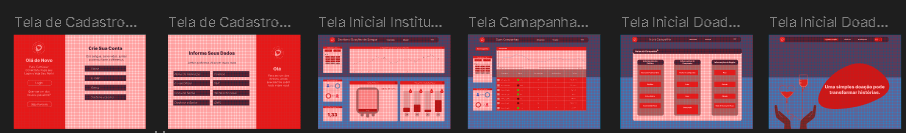
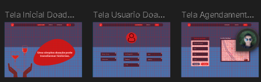
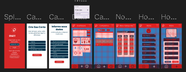

# 5. Interface do Sistema

Pré-requisitos: <a href="4-Gestão-Configuração.md"> Planejamento do Projeto</a>

## 5.1 Tecnologias Utilizadas

> Liste todas as tecnologias utilizadas no projeto, com justificativas breves para cada escolha.  
> Este quadro deve ser atualizado sempre que novas ferramentas forem adicionadas ou substituídas.

| Categoria             | Tecnologia/Ferramenta | Justificativa de uso |
|-----------------------|------------------------|----------------------|
| Linguagem             | JavaScript             | Implementação das funcionalidades do front-end. |
| Framework Front-end   | React.js               | Criação de interfaces dinâmicas e reutilizáveis. |
| Banco de Dados        | MySQL                  | Armazenamento e gerenciamento de dados. |
| Ferramenta de Design  | Figma                  | Criação de protótipos e wireframes. |
| IDE                   | VS Code                | Ambiente principal de desenvolvimento. |

---

## 5.2 Acompanhamento das Interfaces do Sistema

> Esta seção deve funcionar como **registro contínuo do progresso** do projeto.  
> Inclua sempre **descrição**, **status**, **data de atualização** e **imagem real** da tela.

### 📋 Quadro de Progresso das Telas

| Requisito/Tela                | Status | Última atualização | Próxima entrega |
|--------------------------------|--------|--------------------|-----------------|
| Tela principal                 | 🟢 Concluída     | 10/08/2025         | -               |
| Tela de login                  | 🟡 Em andamento | 09/08/2025         | 15/08/2025      |
| Tela de cadastro de produto    | 🔴 Não iniciada | -                  | 20/08/2025      |

Legenda: 🟢 Concluído | 🟡 Em andamento | 🔴 Não iniciado

---

### 5.3 Registro Visual das Telas
  ### 5.3.1 Fluxo Desktop

 ### 5.3.2 Fluxo Mobile

Acesso em: https://www.figma.com/design/6qGqol02EhbiDpV4Oa93nI/WireFrame---GiveLife?node-id=0-1&p=f&t=cjXKp7mjsq27O6Wf-0
> **📢 AVISO IMPORTANTE – ATUALIZAÇÃO DE PROGRESSO**  
> *(leia com atenção antes de finalizar a sprint)*  
>
> 1. **Ao final de cada sprint**, atualizar o quadro de progresso com:  
>    - Status da tela (🟢, 🟡 ou 🔴)  
>    - Data da última modificação  
>    - Próxima previsão de entrega  
> 2. Adicionar **imagens reais** das telas desenvolvidas no diretório `images/`.  
> 3. Descrever brevemente as funcionalidades implementadas ou mudanças feitas desde a última atualização.  
>
> 📌 **Objetivo**: Permitir que o professor visualize rapidamente **o que já foi entregue, o que está em andamento e o que ainda falta desenvolver**, garantindo acompanhamento eficaz do projeto.

